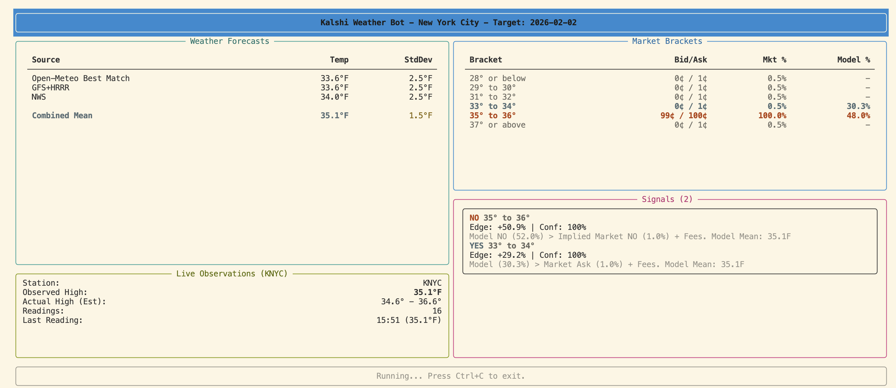

# Kalshi Weather Bot

A Python bot that finds trading edges in Kalshi's NYC Daily High Temperature markets.


It aggregates weather forecasts (NWS, Open-Meteo), tracks live station data from Central Park (KNYC), and uses a probability engine to tell you when the market is wrong.



## How It Works

1.  **Reads the Weather**: Pulls forecasts from GFS, ECMWF, and NWS.
2.  **Watches the Sky**: Tracks real-time temperature at Central Park.
3.  **Computes Odds**: Calculates the probability of every Kalshi bracket winning.
4.  **Finds Edges**: Compares its math vs. the market price to find profitable trades.

## Quick Start

1.  Install dependencies:
    ```bash
    pip install -e .
    ```

2.  Run the dashboard:
    ```bash
    python -m kalshi_weather run
    ```

## CLI Commands

| Command | Description |
|---------|-------------|
| `run` | Launch the interactive trading dashboard |
| `status` | Check market status and available dates |
| `brackets` | Display current market brackets and prices |
| `forecasts` | Show weather forecasts from all sources |
| `settlement` | View historical settlement temperatures |
| `dsm` | Fetch official Daily Summary Message (DSM) reports |
| `cities` | List supported cities |

### Settlement Command

View official settlement temperatures from NWS Daily Climate Reports (the same source Kalshi uses):

```bash
# Yesterday's settlement
python -m kalshi_weather settlement

# Specific date
python -m kalshi_weather settlement --date 2026-01-25

# Last 7 days
python -m kalshi_weather settlement --days 7
```

### DSM Command

Fetch the raw Daily Summary Message (DSM) from the NWS. This is the official source for daily High/Low temperatures used for settlement.

```bash
# Get the latest DSM report
kalshi-weather dsm

# Get the latest report for a specific date
kalshi-weather dsm --date 2026-02-02

# Get ALL versions/updates for a date
kalshi-weather dsm --date 2026-02-02 --all
```

## Documentation

*   [Usage & Signals Guide](docs/usage_guide.md) - How to read the dashboard and trade.
*   [Technical Reference](docs/technical_documentation.md) - The math and code under the hood.

## Configuration

Check `.env` to tweak settings like:
*   `MIN_EDGE_THRESHOLD` (Default: 8%)
*   `DEFAULT_CITY` (Default: NYC)

## License

MIT